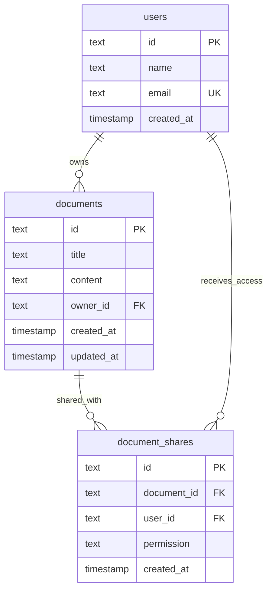

# DocFlow Architecture

This document describes the architectural layout, technology stack choices, database design, and key trade-offs in DocFlow.

---

## System Architecture

DocFlow is built using a classic **client-server decoupling** model. The frontend (Single Page Application) communicates with the backend (RESTful API Server) over HTTP.

```
┌────────────────────────────────────────────────────────┐
│                      React Client                      │
│   (Vite + Tailwind v4 + TipTap Rich-Text Workspace)    │
└───────────────────────────┬────────────────────────────┘
                            │ (JSON/HTTP API)
                            ▼
┌────────────────────────────────────────────────────────┐
│                     Express Server                     │
│         (Routing, Access Check, File Parsing)          │
└───────────────────────────┬────────────────────────────┘
                            │ (dbService abstraction)
                            ▼
           ┌─────────────────┴─────────────────┐
           ▼                                   ▼
   SQLite (Local Dev)                 PostgreSQL (Prod)
      (docflow.db)                      (DATABASE_URL)
```

---

## Frontend / Backend Responsibilities

### 1. Frontend (`client/`)
- **Render UI**: Renders the view states (Login, Dashboard, TipTap Editor Workspace, Share Modal, and Upload fields).
- **Rich Text Integration**: Configures TipTap modules with formatting capabilities (Bold, Italic, Underline, Heading 1, Heading 2, Bullet Lists, and Numbered Lists).
- **Autosave Engine**: Tracks keystrokes and document modifications, throttling database writes using a 1-second debounce window to minimize server load.
- **Client Routing**: A simple, bulletproof state router (`App.jsx`) managing login status and workspace views.

### 2. Backend (`server/`)
- **API Router**: Exposes endpoints for authentication, document creation, updates, deletes, and sharing logic.
- **Security Check Middleware**: Evaluates incoming headers (`x-user-id`) and validates ownership or shared access before database CRUD executions.
- **Database Abstraction**: Implements a unified driver (`db.js`) managing transparent connection handling and parameter bindings for SQLite and PostgreSQL.
- **File Ingest**: Reads plaintext and markdown imports, sanitizing the input before converting it into editable HTML.

---

## Database Structure

We utilize a relational schema containing three tables: `users`, `documents`, and `document_shares`.



---

## Authentication Approach

For quick local evaluation, DocFlow uses **Demo Authentication**:
- The UI exposes a login dialog displaying two pre-seeded users (`kirtan@demo.com` and `alex@demo.com`), plus support for registering a custom name/email on the fly.
- Authenticated state is cached in `localStorage` client-side and attached to each API query under the `x-user-id` header.
- The server validates the ID against the `users` table to identify and authorize transactions.

---

## Document Persistence & Auto-Saving

- Documents are stored as HTML strings (generated by TipTap).
- Client updates are fired automatically as the user types, using a debounced timer.
- The UI shows visual indicators for the save states: **Saving...**, **Saved**, and **Error**.

---

## Sharing Model & Access Control

Permissions are verified recursively on each document endpoint:
1. **Owner**: Full read, write, sharing, and deletion privileges.
2. **Editor (Shared)**: Read and write privileges. Title and content editing are allowed, but deleting or sharing is blocked.
3. **Viewer (Shared)**: Read-only access. TipTap editor toggles `editable: false`, formatting tools are disabled, and saving is locked.

---

## Trade-offs & Scope Decisions

- **WebSockets / CRDTs (Real-time Collaboration)**: Real-time concurrent multi-user editing was intentionally deferred. Implementing OT (Operational Transformation) or CRDTs (Conflict-free Replicated Data Types) increases complexity and risks timebox overflow. The debounced auto-saving engine provides excellent durability while keeping the code simple and robust.
- **Full Password Authentication**: Full cryptographic passwords and multi-factor auth were bypassed. Seeded demo accounts allow the reviewer to evaluate user-switching and sharing immediately without signing up.
